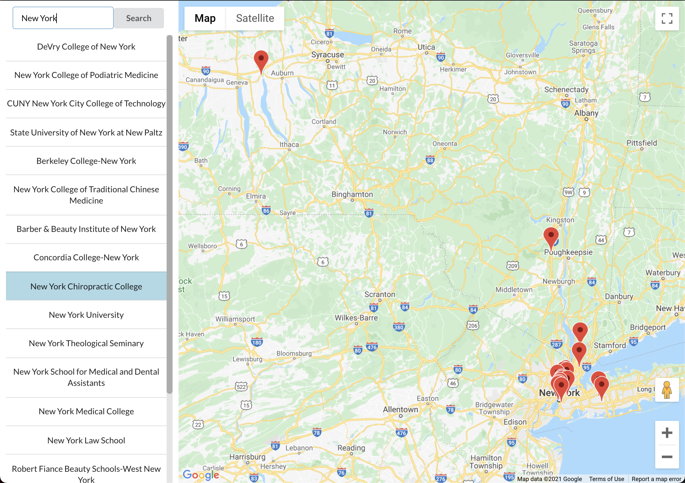

Entera Assignment: College Search
=================================

Original prompt: [entera_test.md](https://gist.github.com/zstarer/8fb0f7e982cca161761caa65a7e062ba)

> Using the College Scorecard API provided by the department of education, please create a page that includes:
> 
> 1. A search box for college names
> 2. Use Google Maps to display the location of each college returned​
> 
> Reference
> https://collegescorecard.ed.gov/data/documentation/ https://github.com/RTICWDT/open-data-maker/blob/master/API.md


Code Walkthrough
----------------

It appears that the prompt could've been finished with simply a front-end, but I decided to use both Rails and React since those are the primary frameworks in the job description.

Making the client ask our Rails back-end to talk to an external API increases our response time, but there are some key advantages:

1. We can conceal our api.data.gov API key. If this was available in the front-end, then malicious users could pose as us to make requests, get banned, and break our application. 
2. We could cache and fetch results, such that subsequent searches for popular terms completely skip requests to an external API.

The notable React code in `./client` is:

- [client/README.md](client/README.md): Installation and run instructions.
- client/src/App.js: Initialize hooks that ResultsPane and SearchBox use to communicate. Hits the rails endpoint to fetch results.
- client/src/components/Map.js: Loads the Google Map viewer. Can place pins and zoom to fit all pins in the viewer's visible area.
- client/src/components/ResultsPane.js: Loads results into a left-side pane when a search is performed. 
- client/src/components/SearchBox.js: Handles the search input box, button, and firing off a search.

The notable Rails API code in `./api` is:

- api/README.md: Installation and run instructions.
- api/app/controllers/api/v1/college_controller.rb: Gets no more than one page of results from the external API using the CollegeScoreCardService.
- api/app/models/college_score_card_school.rb: A table-less model that contains a single school's information.
- api/app/serializers/serializable_college_score_card_school.rb: The JSONAPI serializer for returning schools.
- api/app/services/college_score_card_service.rb: Service for requesting data from external API (https://api.data.gov/ed/collegescorecard/)
- api/config/secrets.yml: Contains the external API's key. The key is plaintext for development environments; in a production environment, it would be fetched from an environment variable so that a malicious user who gained access to our code wouldn't also have our private keys.
- api/spec/acceptance/college_controller_spec.rb: An rspec_api_documentation test that asserts the results of the endpoint (with a mocked CollegeScoreCardService to prevent requests to the third-party API) and generates documentation when `$ rake docs:generate` is run.


User Acceptance Testing
-----------------------

### Happy Path Workflow

1. GIVEN you start the API on port 3001
2. AND you start the client
3. WHEN you search for a term that has expected results, like _New York_
4. AND you hit enter or click the Search button
5. THEN a loading spinner appears in the Results Pane
6. AND the google map will zoom such that all pins related to the search term should be in the viewable area
7. WHEN you mouse over a results pane item
8. THEN the school's corresponding pin on the map should bounce
9. WHEN you mouse over pins on the google map
10. THEN its associated row in the results pane is highlighted _(note: results pane does not scroll to the highlighted result, so if it's off-screen, you may not notice it)_


### No Results Workflow

1. GIVEN you start the API on port 3001
2. AND you start the client
3. WHEN you search for a term that doesn't have expected results, like _zzzzz_
4. AND you hit enter or click the Search button
5. THEN a loading spinner appears in the Results Pane
6. AND you will see a message that says no results were found.


Automated Testing
-----------------

To run backend tests:

```sh
$ cd client
$ bundle exec rspec
```


Generate API Endpoint Documentation
-----------------------------------

```sh
$ cd api
$ rake docs:generate
# You can view the HTML output in api/doc/api/index.html
```


Screenshots
-----------

### Initial Page Load:


### Search Results Pane:


### Active Item:
